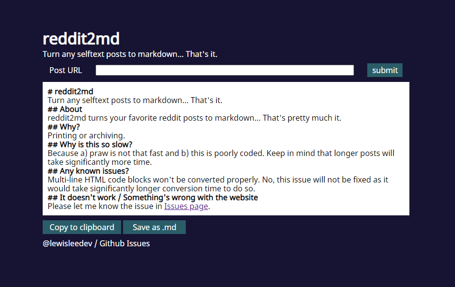

# reddit2md-web

Turn your favorite reddit posts to markdown via web.

## Why?

Printing and archiving.

## Getting Started

### Installing

* `git clone https://github.com/lewisleedev/reddit2md.git`
* Make sure you also filled out settings.py file (visit [reddit's application page](https://www.reddit.com/prefs/apps/) for API keys.)

## Known Issues

* Multi-line HTML code blocks won't be converted properly.

## Authors

Lewis Lee
[@lewislee](https://github.com/lewisleedev)

## Version History

* 0.1.0
    * Initial Release

## License

This project is licensed under the MIT License - see the LICENSE.md file for details